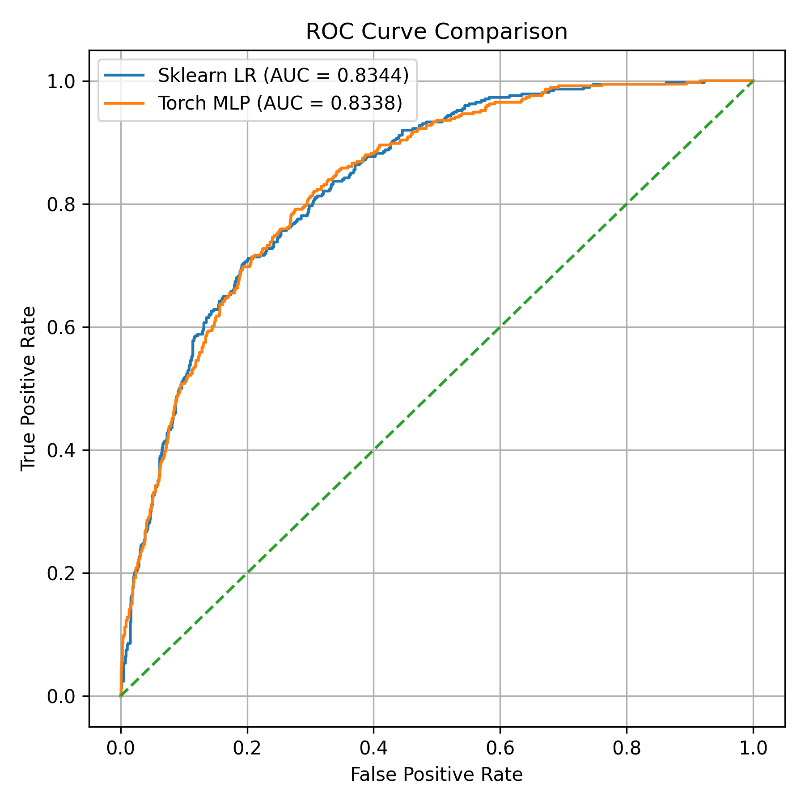
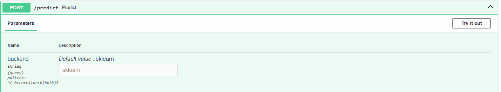
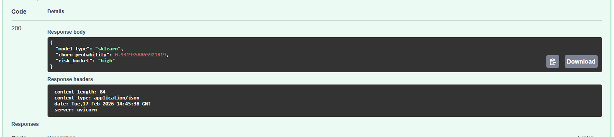

# Telco Churn Risk Scoring Service (production-style ML pipeline)

End-to-end churn prediction system made to demonstrate understanding of **production ML workflow**:
- reproducible training + artifact saving
- leakage-safe splitting + preprocessing
- model comparison (sklearn LR vs PyTorch MLP)
- calibration + latency evaluation
- drift monitoring
- FastAPI serving with selectable backend (`sklearn|torch|both`)


my goal for this project is to predict the probability that a telco customer will churn, so a business can target retention actions (discounts, outreach, contract changes) toward high-risk customers.

The output of this pipeline is a churn probability + a simple risk bucket (`low/medium/high`).

---

## Project structure

```text
.
├─ data/
│  ├─ raw/            # raw CSV input (not committed)
│  └─ processed/      # optional cleaned CSV
├─ models/
│  ├─ sklearn/
│  │  ├─ model.joblib
│  │  └─ metadata.json
│  └─ torch/
│     ├─ model.pt
│     ├─ metadata.json
│     └─ preprocessor.joblib
├─ reports/
│  ├─ metrics.json
│  ├─ comparison.md
│  └─ drift.json
├─ assets/
├─ scripts/
└─ src/

```

---

## Dataset

- **Source:** IBM Telco Customer Churn dataset (Mine is from https://www.kaggle.com/datasets/blastchar/telco-customer-churn)

- Place the CSV at: data/raw/telco.csv
- **Target:** `Churn` mapped {Yes → 1, No → 0}
- **Dropped:** `customerID` (identifier)
- **Cleaning:** `TotalCharges` is coerced to numeric; rows with invalid values are dropped.

---

## Preprocessing (leakage-safe)

All splitting happens before fitting preprocessing to prevent test leakage.

**Numeric features**
- SimpleImputer(strategy="median") for missing values
- StandardScaler() for stable optimization and consistent feature scale

**Categorical features**
- SimpleImputer(strategy="most_frequent"
- OneHotEncoder(handle_unknown="ignore") for robust inference (unknown categories won’t crash the API)

Implemented as a ColumnTransformer built from column dtypes.

**Important production detail**
- sklearn: preprocessing is bundled inside the saved pipeline artifact (model.joblib)
- torch: preprocessing is saved as a separate artifact (models/torch/preprocessor.joblib) and loaded by the API

---

## Models

### 1) scikit-learn Logistic Regression (baseline)
- Pipeline: preprocess → LogisticRegression
- Hyperparameter tuning: GridSearchCV over `C` 
- CV scoring metric used: ROC-AUC
- Saved artifact (after running script): models/sklearn/model.joblib (contains preprocessing + model)

### 2) PyTorch MLP (challenger)
- Trained on the same preprocessed feature space
- Uses early stopping based on validation ROC-AUC
- Saved artifacts:
  - models/torch/model.pt
  - models/torch/metadata.json
  - models/torch/preprocessor.joblib (**required for correct inference**)

---

## Evaluation and reporting

The evaluation pipeline produces:
- ROC-AUC, PR-AUC (discrimination / ranking)
- Threshold metrics at 0.5: precision, recall, F1, confusion matrix
- Calibration: Brier score + calibration curve points
- Latency: ms per inference run on a sample

Outputs:
- reports/metrics.json
- reports/comparison.md

<p align="center">  </p>

---

## Drift monitoring

drift_report compares reference vs current feature distributions:
- Numeric features: KS test
- Categorical features: chi-square test on normalized frequencies

Output:
- reports/drift.json (per-feature stats + ranked top drifting features)

From my results I found that there is no evidence of drift as all the p-values are close to 1

---

## Quickstart

1) Environment setup

python -m venv .venv
# Windows:
.venv\Scripts\activate
# macOS/Linux:
source .venv/bin/activate

pip install -r requirements.txt

Place dataset:
data/raw/telco.csv

2) Train models

Sklearn LR:
python -m scripts.train_sklearn

Torch MLP:
python -m scripts.train_torch

3) Evaluate and compare
python -m scripts.evaluate_models

Check results:
type reports\comparison.md
type reports\metrics.json

4) Run API (http local way)
python -m scripts.run_api
Open docs:

http://127.0.0.1:8000/docs

"Once on that link you will see a basic fastAPI UI in which you can use the /predict feature to use the model for a new example. You can then choose if you want to use the Logistic Regression model from scikitlearn by typing 'sklearn' on the backend description or the MLP from pytorch by typing 'torch' on the backend description (or you can use both at the same time by typing 'both') Once there click Try it out and change the values as you wish on the request body, then press execute. You will then be able to see the response body with the predicted churn_probability and risk_bucket for your inputs."





5) Call the API (manual terminal way)
Default (sklearn):

curl -X POST "http://127.0.0.1:8000/predict" -H "Content-Type: application/json" -d "{...}"
Torch:

curl -X POST "http://127.0.0.1:8000/predict?backend=torch" -H "Content-Type: application/json" -d "{...}"
Both:

curl -X POST "http://127.0.0.1:8000/predict?backend=both" -H "Content-Type: application/json" -d "{...}"

6) Drift report
python -m scripts.drift_report
type reports\drift.json


"FULL VERIFIED SETUP TO RUN PROJECT"
python --version  # should be 3.12.x
python -m venv .venv
.venv\Scripts\activate
python -m pip install --upgrade pip setuptools wheel
pip install -r requirements.txt

make sure dataset is in required place (specified above)
python -m scripts.train_sklearn
python -m scripts.train_torch
python -m scripts.evaluate_models
python -m scripts.run_api
